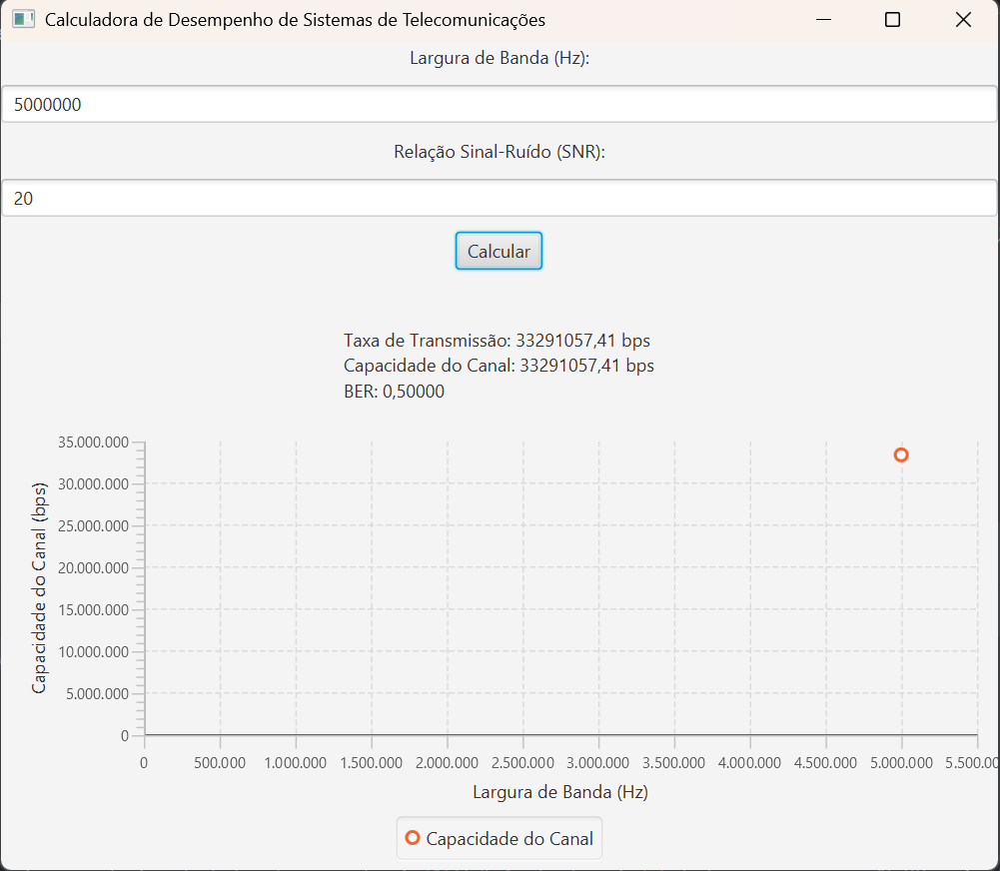

# Calculadora de Desempenho de Sistemas de Telecomunicações

A **Calculadora de Desempenho de Sistemas de Telecomunicações** é uma ferramenta interativa projetada para calcular e analisar o desempenho de sistemas de telecomunicações com base em parâmetros técnicos, como a largura de banda e a relação sinal-ruído (SNR). A aplicação utiliza fórmulas matemáticas para calcular três métricas principais de desempenho: **taxa de transmissão**, **capacidade do canal** e **taxa de erro de bit (BER)**.

#### Funcionalidades:
- **Taxa de Transmissão (T)**: Calcula a quantidade de dados transmitidos por segundo, levando em consideração a largura de banda e a relação sinal-ruído do sistema. Esse valor indica a eficiência do sistema de comunicação na transmissão de dados.
  
- **Capacidade do Canal (C)**: Calcula a máxima capacidade de um canal de comunicação, ou seja, o maior volume de dados que pode ser transmitido sem erro, dado um valor de SNR e largura de banda específicos.
  
- **Taxa de Erro de Bit (BER)**: Estima a probabilidade de erro na transmissão de dados. Um valor de BER muito baixo indica uma comunicação eficiente e de alta qualidade.

#### Como Usar:
1. **Entrada de Dados**: Insira os valores de **largura de banda** (em Hertz) e **relação sinal-ruído (SNR)** (em decibéis) nos campos de entrada da interface.
2. **Cálculo**: Após preencher os dados, clique no botão "Calcular" para calcular a taxa de transmissão, a capacidade do canal e o BER.
3. **Visualização dos Resultados**: A aplicação mostrará as métricas calculadas na interface, permitindo ao usuário avaliar rapidamente o desempenho do sistema de telecomunicações.

#### Exemplos de Valores para Testar:
- **Largura de Banda**: 5000000 Hz (5 MHz)
- **SNR**: 20 dB

#### Importância:
Essa ferramenta é útil para engenheiros, técnicos e estudantes de telecomunicações que desejam analisar o desempenho de sistemas de comunicação de maneira prática e acessível. Ela pode ser aplicada para simular diferentes cenários de transmissão e entender melhor os efeitos do SNR e da largura de banda sobre o desempenho do sistema.

## Créditos

Desenvolvido por Mateus S.  
GitHub: [Matz-Turing](https://github.com/Matz-Turing)
